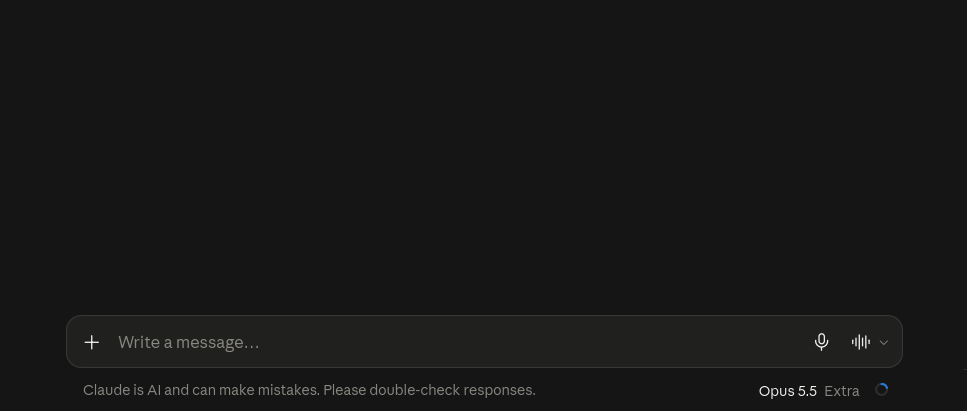
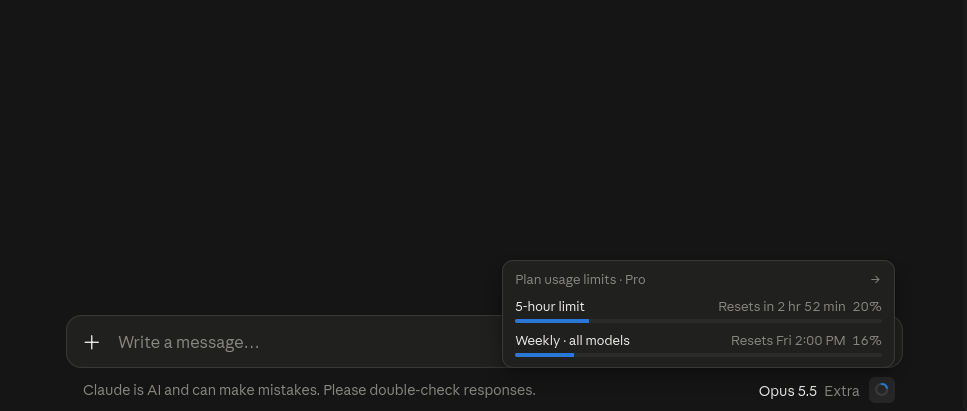

# Claude Usage Ring

A small browser extension that brings the round **usage button and popup from `claude.ai/code`** into the
composer of regular claude.ai chats (`/new` and `/chat/*`). It shows your plan limits (5-hour and weekly
windows, plus usage credits if enabled) and nothing about tokens or the context window.

- Firefox (and forks such as Floorp) and Chrome / Chromium, Manifest V3
- Looks identical to the original: same markup and the same compiled CSS rules, isolated in a Shadow DOM
- Supports all languages Claude's UI offers: English, Français, Deutsch, हिन्दी, Bahasa Indonesia, Italiano,
  日本語, 한국어, Português (Brasil), Español (Latinoamérica), Español (España)
- Only talks to `claude.ai` with your existing session. No analytics, no third parties.

<p align="center">
  
  
</p>

> **Unofficial.** Not affiliated with or endorsed by Anthropic. It uses the same internal, undocumented endpoint
> as claude.ai itself (`GET /api/organizations/{id}/usage`), which can change at any time.

## How it behaves

- Click the ring to open the popup; click outside or press `Esc` to close it.
- The ring shows the highest usage among your plan windows and turns yellow/red near the limit.
- Refreshes every 60 s (visible tab only), when the popup opens, after you send a prompt, and when you return to the tab.
- On errors the ring is empty and values show `–`.
- If your account already shows the native ring in the composer, the extension stays out of the way.

## Install

### Firefox / Floorp (signed build)

1. Download `claude-usage-ring-<version>.xpi` from the [latest release](https://github.com/david-x3d/claude-usage-ring/releases/latest).
2. Open `about:addons` → gear icon → **Install Add-on From File…** and pick the file.

The build is signed by Mozilla (unlisted), so it survives restarts.

### Chrome / Chromium / Edge

There is no store listing or prebuilt package yet. [Build from source](#build-from-source), then open
`chrome://extensions` → enable **Developer mode** → **Load unpacked** → pick `dist/chrome`.

## Build from source

1. Open <https://claude.ai> in your browser, open DevTools → Console and run
   ```js
   [...document.styleSheets].map(s => s.href).filter(Boolean)
   ```
2. Copy the URLs ending in `.css` (at the time of writing two files on `assets-proxy.anthropic.com`).
3. Build (Node 18+):
   ```sh
   npm run css -- <css-url-1> <css-url-2>
   npm run build
   ```
   `npm run css` keeps only the rules for the classes used in `src/markup.js`. You can also pass local `.css` files.
   Re-run it when claude.ai changes its design.

This creates `dist/firefox` and `dist/chrome`.

- **Firefox, temporary:** `about:debugging#/runtime/this-firefox` → **Load Temporary Add-on…** → `dist/firefox/manifest.json`
  (removed on restart). Or with [web-ext](https://github.com/mozilla/web-ext): `npm run start:firefox`
  (`web-ext run --firefox=floorp …` for Floorp).
- **Chrome:** see above, load `dist/chrome`.

### Signing a Firefox build (maintainers)

Mozilla signs unlisted add-ons for free:

1. Create API credentials at <https://addons.mozilla.org/developers/addon/api/key/> and export them in your shell
   (`WEB_EXT_API_KEY`, `WEB_EXT_API_SECRET`; never commit or share them).
2. Bump `version` in `manifests/firefox.json` and `package.json`; the script refuses a version that is not higher
   than the last signed one.
3. `npm run sign:firefox` builds, signs and writes `web-ext-artifacts/*.xpi` (git-ignored).
4. Attach the `.xpi` to a GitHub release by hand.

## Project layout

| Path | Purpose |
|---|---|
| `src/content.js` | Injection (MutationObserver), popup behaviour, refresh logic |
| `src/usage-api.js` | The only network code: `GET /api/organizations`, `GET /api/organizations/{id}/usage` (same-origin, `credentials: "include"`) |
| `src/markup.js` | Markup of button and popup, taken from claude.ai/code |
| `src/i18n.js`, `src/locales.json` | Strings copied from claude.ai's message catalogs, plus reset-time formatting |
| `tools/build-css.mjs` | Extracts the needed CSS rules from claude.ai's stylesheets |
| `tools/build.mjs` | Assembles `dist/firefox` and `dist/chrome` |
| `manifests/` | One manifest per browser |

### Adding or updating a language

Catalogs live at `https://claude.ai/i18n/<locale>.json` (e.g. `de-DE`). The 19 message IDs used are listed in
`src/locales.json` keys; copy the values for a new locale from the catalog and add it there.

## Permissions

`https://claude.ai/*` only (content script and same-origin requests). No background page, no storage, no other hosts.

## Known limitations

- The plan name ("Pro", "Max (5x)", …) is derived from fields of `/api/organizations`; confirmed for Pro, other plans may be wrong.
- After sending a prompt the usage is re-fetched after 3, 15 and 45 seconds rather than exactly when the answer ends.
- The popup has no open/close animation and no hover tooltip on the button.
- Anchoring depends on the composer's model selector (`data-testid="model-selector-dropdown"`); if claude.ai renames it,
  a fallback next to the send button is used.

## License

MIT
